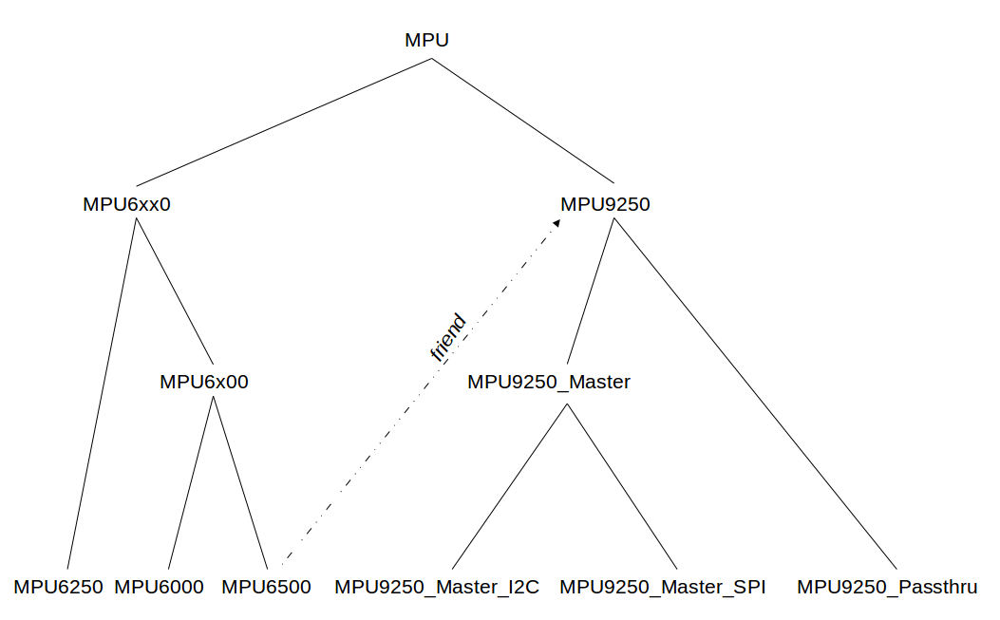

This repository derives from a few different Arduino sketches created by [Kris Winer](https://github.com/kriswiner) 
to support the InvenSense MPU line of Internal Measurement Unit (IMU) sensors.  

Here's what I changed:
* Reorganized Kris's
[source code](https://github.com/kriswiner/MPU9250/tree/master/MPU9250_BME280_SPIFlash_Ladybug) 
into the modern Arduino library [format](https://github.com/arduino/arduino/wiki/arduino-ide-1.5:-library-specification)
* Simplified the API
* Added support for RaspberryPi via [WiringPi](http://wiringpi.com/)
* Added support for NVIDIA Jetson via i2cdev
* Simplified the 
[examples](https://github.com/kriswiner/MPU9250/blob/master/MPU9250_BME280_SPIFlash_Ladybug/MPU9250_BME280_SPIFlash_Ladybug.ino) 
by removing code requiring components other than the MPU sensors

The following sensors are currently supported:

* MPU6000 
* MPU6050 
* MPU6500 
* MPU9250 

To use this library you will also need to clone the cross-platform support
[library](https://github.com/simondlevy/CrossPlatformDataBus).

The MPU6000 and 6500 communicate over the SPI buss. The MPU6050 communicates
over the I2C bus.  The MPU9250 is a bit more complicated: in
<i>master mode</i> you access both sensors (MPU6500 accelerometer/gyrometer, AK8963 magnetometer)
at once, over the I2C or SPI bus. In <i>pass-through mode</i> you
communicate directly with the IMU and magnetometer over the I2C.

I have tested this library on the following hardware:

* [Butterfly STM32L433](https://www.tindie.com/products/TleraCorp/butterfly-stm32l433-development-board/) 
development board, I2C

* Teensy 3.2 development board, I2C

* Raspberry Pi 3, I2C

* Raspberry Pi Zero with [PXFMini](http://erlerobotics.com/blog/product/pxfmini/) autopilot shield, SPI 

* NVIDIA Jetson TX1, I2C

* Omnibus F3 flight controller (MPU6000)

* Alienflight F3 V1 flight controller (MPU6050)

* SPRacing F3 flight controller (MPU6500)

RaspberryPi users should download and install
[WiringPi](http://wiringpi.com/), then cd to one of the example folders (e.g., <b>extras/code/wiringpi/MPU6050</b>
and type <tt>sudo make run</tt>.

NVIDIA Jetson users should install I2C support by running the command:
<pre>
  sudo apt-get install libi2c-dev i2c-tools
</pre>

## Design Principles

As shown in the class hiearchy diagram below, the MPU library makes extensive use of C++ inheritance to share common code:

Because the MPU9250 contains an MPU6500, the MPU9250 is allowed to be a &ldquo;friend&rdquo; class of the MPU6500,
sharing some of the latter's code.
